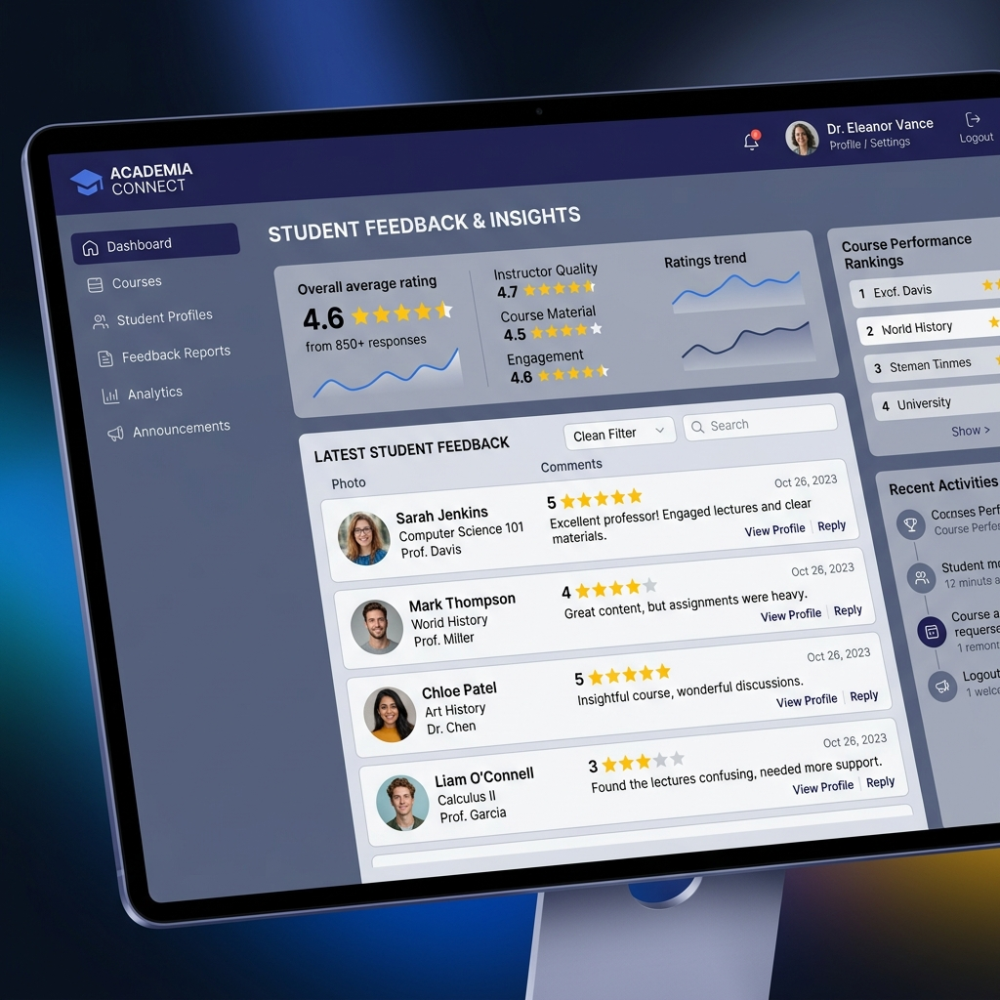

# 🎓 Student Feedback Review System



A modern, full-stack application designed for students to provide reviews for their courses and instructors. Built with a focus on premium aesthetics, glassmorphism, and a smooth user experience powered by React and Framer Motion.

## 🛠️ Technology Stack


## ✨ Key Features
- **Interactive Star Ratings:** Custom star components for intuitive and engaging feedback.
- **Glassmorphism UI:** Beautiful, frosted-glass design with a deep Indigo & Slate palette.
- **Admin Dashboard:** Real-time stats and feedback aggregation using MongoDB.
- **Micro-Animations:** Smooth transitions and layout animations powered by `Framer Motion`.
- **Database Flexibility:** Uses `mongodb-memory-server` for instant testing without a local MongoDB installation.

## 🚀 Getting Started

### 🔌 Port Configuration
- **Client**: `http://localhost:5175`
- **Server**: `http://localhost:5005`

### 🏗️ Running Locally

1. **Install Dependencies**:
   ```bash
   cd client && npm install
   cd ../server && npm install
   ```

2. **Start Backend**:
   ```bash
   cd server
   npm run dev
   ```

3. **Start Frontend**:
   ```bash
   cd client
   npm run dev -- --port 5175
   ```

## 📂 Project Structure
- `/client`: Frontend React application.
- `/server`: Backend Express API & Mongoose models.

---
*Part of the Full Stack Development Assignment Series.*
