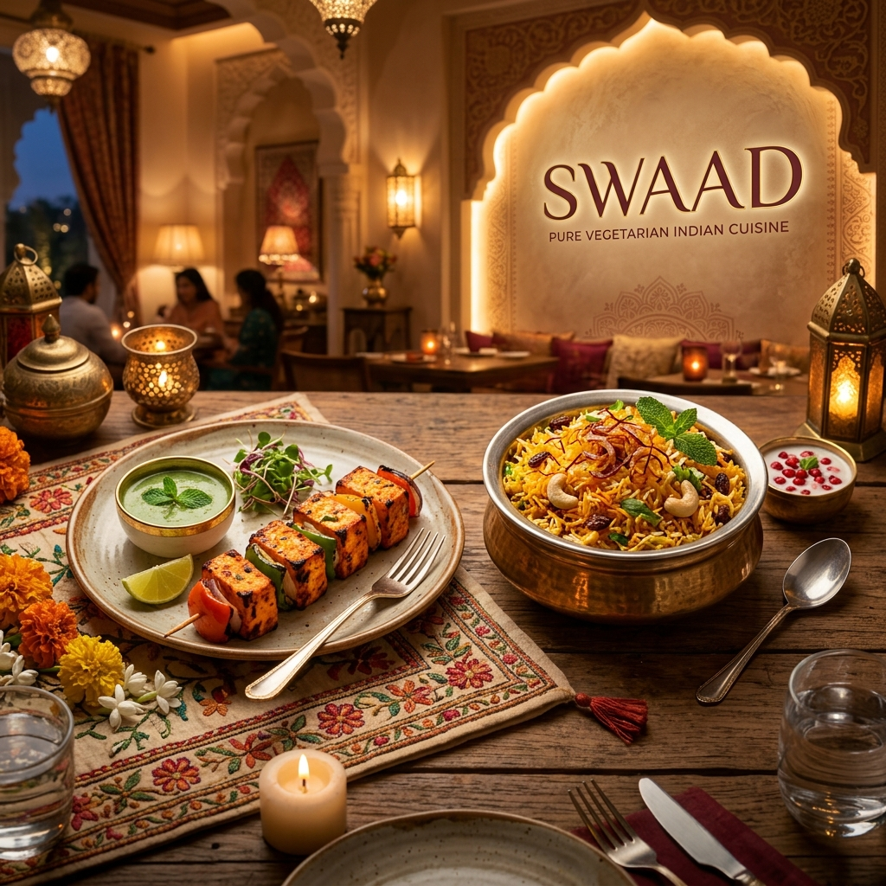

# 🍛 Swaad - Indian Pure Veg Restaurant

An elegant, fully responsive website for an authentic pure vegetarian Indian restaurant named "Swaad". It features modern animations, a dynamic menu filter, and beautiful image galleries, delivering an immersive culinary experience.

## 🛠️ Technology Stack

## ✨ Key Features
- **Immersive Hero Section:** Engaging hero banner with floating scroll indicators and fade-in animations for a premium feel.
- **Dynamic Menu:** A categorized menu system allowing users to filter dishes by Starters, Mains, Desserts, and Drinks in real-time.
- **Cart & Ordering:** Includes a sliding cart sidebar, toast notifications for adding items, and a persistent checkout flow.
- **Reservation System:** A complete reservation form with validation for name, email, phone, date, time, and guest count.
- **Visual Excellence:** Features a testimonials carousel, a culinary image gallery via Lightbox, and curated typography.

## 🚀 How to View
To interact with the website, simply open `index.html` in any modern web browser. All features like the cart and menu filters are handled via client-side JavaScript for an instant, responsive feel.

---
*AI for debugging and snippet generation.*
*Part of the Full Stack Development Assignment Series.*
